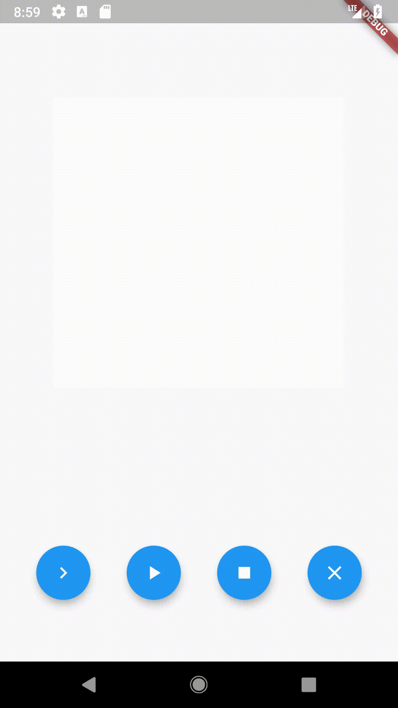

# Draw a Flip Book

This is a project coded during [The Boring Development Show, Episode 28](https://www.youtube.com/watch?v=yyHhloFMNNA) with [@maryx](https://github.com/maryx)!

The current version looks like this:

The [original version](https://github.com/drinkthestars/end_of_show_main.dart).

